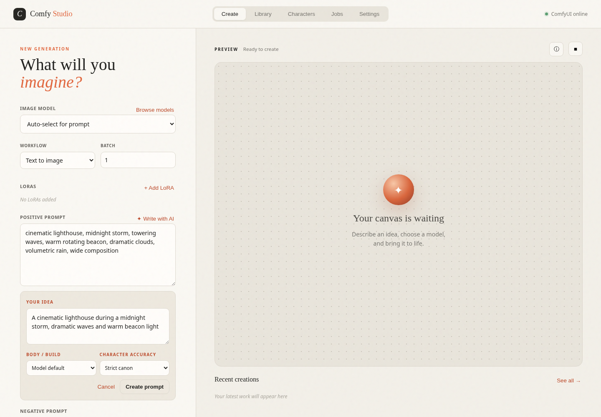
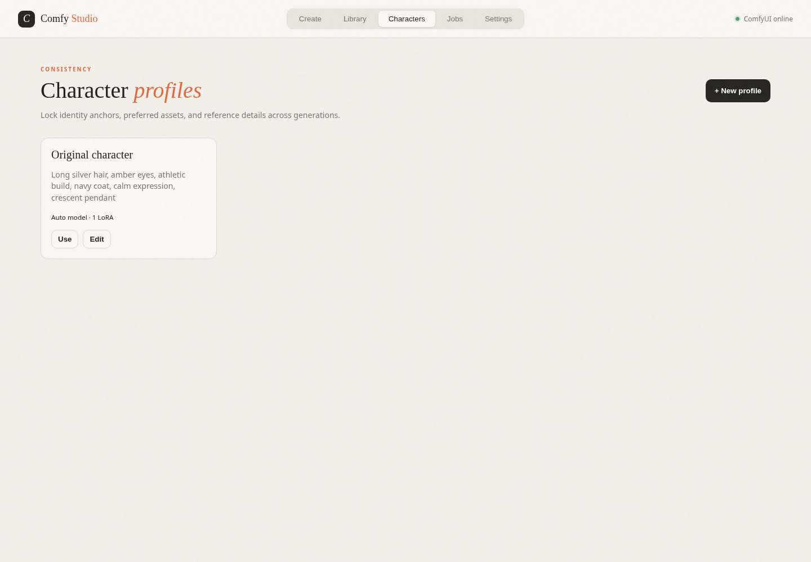

# Comfy Studio

A focused, responsive web UI for a ComfyUI instance running on this machine or another PC on your network.

[Project page](https://agentmediatools.com/comfy-studio) · [Latest release](https://github.com/Pedregoneric/comfy-studio/releases/latest)



Free and open source under the MIT license. Comfy Studio makes model and LoRA selection, prompt writing, character consistency, generation history, and agent-driven image creation approachable without replacing ComfyUI's workflow engine.

## Support the project

Comfy Studio is free forever—no paid edition or locked features. If it saves you time, you can optionally [leave a one-time tip](https://agentmediatools.com/tip?from=comfy-studio). Skipping it changes nothing.

## Start

Node.js 18 or newer is required.

```bash
cd comfy-studio
COMFY_URL=http://192.168.1.50:8188 npm start
```

Replace `192.168.1.50` with the main PC's LAN address. Open `http://localhost:3030`.

If the UI runs on the main PC too, omit `COMFY_URL`; it defaults to `http://127.0.0.1:8188`. Set `PORT=8080` to use another UI port.

You can also copy `.env.example`, edit it, and export its values before starting:

```bash
cp .env.example .env
set -a
. ./.env
set +a
npm start
```

ComfyUI must listen on the network when it is on another computer. Start ComfyUI with `--listen 0.0.0.0` and allow TCP port 8188 through that computer's firewall. Keep it on a trusted LAN; do not expose ComfyUI directly to the public internet.

## Tailscale-only access

Bind the web UI to this computer's Tailscale address and point it at the main PC's Tailscale address:

```bash
HOST=$(tailscale ip -4) PORT=3030 COMFY_URL=http://MAIN_PC_TAILSCALE_IP:8188 npm start
```

You can then open `http://THIS_PC_TAILSCALE_IP:3030` from any device on the same tailnet. The included `comfy-studio.service` can run it persistently; update its two Tailscale addresses before enabling it on another machine.

## Included

- Automatic checkpoint, diffusion model, LoRA, sampler, and scheduler discovery
- An automatic Anima/Qwen Image workflow for modular Anima models
- Positive and negative prompts
- Multiple LoRAs with independent strength
- Size, steps, CFG, sampler, scheduler, and seed settings
- Named presets stored in the browser
- ComfyUI queue submission and generation polling
- Image/video output preview and ComfyUI-backed creation history
- Responsive desktop/mobile layout
- Searchable model and LoRA browser with favorites, compatibility hints, and usage counts
- Character profiles with locked identity anchors and preferred assets
- Generation records with prompt inspection, reuse, and variation actions
- Batch generation, queue monitoring, interruption, and pending-queue clearing
- Reference-image img2img and alpha-mask inpainting
- Built-in 2× output upscaling
- Imported ComfyUI API workflows for custom nodes and video pipelines
- Side-by-side output comparison
- Agent job tracking and retry handoff
- Feedback-driven prompt revision after reviewing a generated result
- OpenAI-compatible AI prompt writer with a safe connection test
- Model-aware prompt dialects for Illustrious/NoobAI/Animagine, Pony, SDXL, SD 1.5, FLUX, and Qwen Image/Anima
- ComfyUI-native LoRA prompting: node-loaded weights with exact activation triggers in the positive prompt
- Canonical character identity briefs for established characters, covering appearance, proportions, default outfit, signature traits, and originating-series style



The built-in generator creates a standard checkpoint text-to-image workflow. Existing custom ComfyUI workflows are not modified.

The Settings page supports changing the ComfyUI endpoint, refreshing its model index, and optionally selecting a ComfyUI root folder when the UI server and ComfyUI share a filesystem. If that folder is unavailable—such as the default Tailscale setup—the app automatically continues using API discovery.

## Agent generation

Agent mode can make the overall experience feel substantially faster by collapsing model and LoRA selection, prompt writing, queue submission, generation polling, and finished-media delivery into one request. It does not accelerate ComfyUI's underlying inference; actual render time still depends on the selected workflow, model, and hardware.

Agents can submit one request and wait for the finished media:

```bash
curl -X POST http://127.0.0.1:3030/api/agent/generate \
  -H 'Content-Type: application/json' \
  -d '{"idea":"a lighthouse in a midnight storm","enhance":true}'
```

Optional fields include `model`, `negative`, `loras`, `width`, `height`, `steps`, `cfg`, `sampler`, `scheduler`, `seed`, and `timeout_ms`. The response includes the final prompt, selected model, seed, prompt ID, and one or more media URLs. A portable agent skill is included under `skills/comfy-studio-image`.

## Workflow notes

- **Image to image:** Upload a reference and adjust denoise. Currently uses full checkpoint models.
- **Inpaint:** Upload an image whose alpha channel represents the mask. The standard `VAEEncodeForInpaint` node is used.
- **Upscale:** Generates normally, then applies a 2× Lanczos image scale before saving.
- **Imported API workflow:** Export a workflow with ComfyUI's “Save (API Format)” command. Imported graphs are submitted unchanged, which supports video and custom-node pipelines without making architecture assumptions.

Local profiles, favorites, records, agent jobs, settings, and credentials live under `data/`. That directory is intentionally excluded from Git.

## Security

Comfy Studio currently has no application-level login. Run it only on a trusted machine, private LAN, or private tailnet. Do not expose it or ComfyUI directly to the public internet. See [SECURITY.md](SECURITY.md) for credential and reporting guidance.

## Contributing

Issues and pull requests are welcome. Run `npm test` before submitting a change. See [CONTRIBUTING.md](CONTRIBUTING.md).
